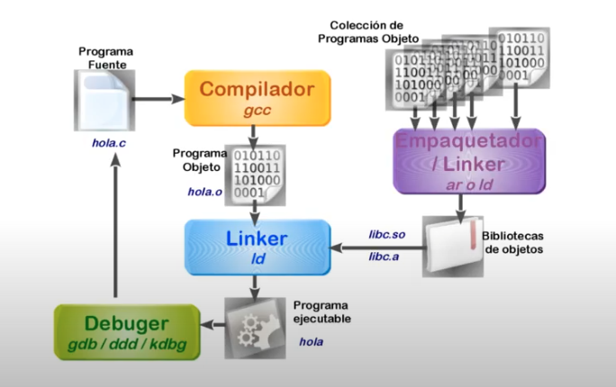
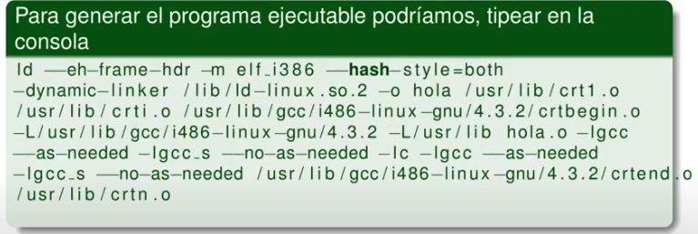

# Herramientas de Desarrollo

* Lenguajes de programacion
  * Assembler
  * Alto Nivel
* C
* Herramientas
  * Ciclo de desarrollo
  * Compilador
  * Linker

## Lenguaje de Programación

### Que lenguaje hablan los microprocesadores?

Las CPU's definidas en los modelos originales fueron pensadas para tratar con valores que pueden tomar dos estados:

* Verdadero - Falso
* 1 - 0
* Tension V - Tension 0

Por este motivo, desde el inicio, cualquier cpu solo "habla" en binario, pero este lenguaje no le resulta "natural" a los humanos.

### Lenguaje Ensamblador / De Maquina

* Cada instrucción tiene un nombre alusivo a la operación que realiza y lo representa por su abreviatura (MOV, ADD).
* Cada sentencia en el programa corresponde a una y solo una instrucción del CPU.
* Con ayuda de un programa llamado Ensamblador o Assembler, se convierte el __código fuente__ en números binarios.

### Lenguajes de Alto Nivel

* Cada sentencia del programa se compone de varias instrucciones del procesador.
* Permite aplicaciones de mayor complejidad con menos texto.
* Con ayuda de un programa llamado Compilador, se convierte ese texto (codigo fuente) a números binarios.

#### C

* `main` llama a otras funciones que van componiendo las partes que solucionan el problema completo (programacion modular).
* Las funciones invocadas por `main` pueden estar escritas en el mismo archivo u otro, inclsuive ser funciones externas en bibliotecas de código ya traducidas a números binarios.

La sentencia `#include <stdio.h>` importa un archivo de texto que __no contiene codigo de la bibliteca__, solamente se declaran funciones que componen la biblioteca para que el compilador pueda conocer la sintaxis correcta para su invocación desde los programas. La biblioteca de código está en otro archivo (binario).

## Herramientas de Desarrollo

### Ciclo de Desarrollo



### Compilador

* Programa capaz de analizar sintácticamente un archivo de texto que contiene un programa fuente.

* Genera un código binario adecuado para ser ejecutado por el Microprocesador que obra como CPU del sistema. Una vez compilado, el producto es un __Programa Objeto__, un binario que __aún no está listo para poderse ejecutar__.

* Ademas de analizar las operaciones, reemplaza los nombres lógicos de variables/funciones por las direcciones de memoria en donde se ubican las mismas.

* No puede resolver referencias a funciones exteriores al archivo fuente que analiza. Por ejemplo, no puede resolver por que valor numérico reemplazar a la etiqueta `printf`, esto tiene que resolverse en la siguiente fase. Los bytes se rellenan con una dirección "ficticia" que será completada por el linker o el S.O en el momento de carga en memoria para su ejecución.

* Antes de hacer su trabajo, invoca un programa denominado __preprocesador__ que se encarga de eliminar los comentarios, incluir otros archivos (la linea `#include <stdio.h>` es reemplazada por el contenido del archivo), y reemplaza los macros (`#define`).
  * Si se genera errores, el programa está mal escrito, sino, solo significamente que la sintaxis/semántica es correcta.

```
gcc -c hola.c -o ho.ao -Wall
```

La opcion `-Wall` indica que se presenten todos los errores (Warning all).

### Linker

Programa capaz de tomar el Programa Objeto generador por el compilador, __enlazarlo__ (linkearlo) con otros programas objeto y biblotecas de código, generando un programa ejecutable por el Sistema Operativo sobre el cual estamos desarrollando.

Es crucial esta fase de la generación de nuestro programa. Hay involucrados unos cuantos objetos sujetos a cuestions internas del sistema.



Para evitar tal situación, gcc sabe llamar al linker

```
gcc -o hola hola.o -v
gcc -o hola hola.o -Wall
```

### Enlazar

Enlazar significa:

* Poner todos los bloques de código juntos y ordenar el código en secciones comunes para luego guardar ese conjunto en un único archivo ejecutable.

* Una vez ordenado, resolver cada referencia a una variable o función que en la fase de compilación eran externas. Por ejemplo `printf`.

* Identificar y marcar el punto de entrada del programa (la dirección que se le asignará a `main`).

### Linkear con una biblioteca

Si por ejemplo incluimos `#include <math.h>` en nuestro programa `sqrt.c` tenemos el siguiente caso.

* Para compilar: `gcc -c sqrt.c -o sqrt.o`
* Para linkear: `gcc sqrt.o -o sqrt -lm`

Si observamos, vemos que al linker se le provee una opcion adicional `-lm`. `-l` sirve para especificar el nombre de una Biblioteca, y `m` es el nombre de la biblioteca (math), cuyos prototipos, macros y constantes estan definidos en `math.h`.

Por que no hubo que especificar la libreria que contiene `printf`? Porque el compilador "conoce" la ubicacion de las bibliotecas mas comunes para evitar que debamos especificar constantemente librerias de uso comun.
