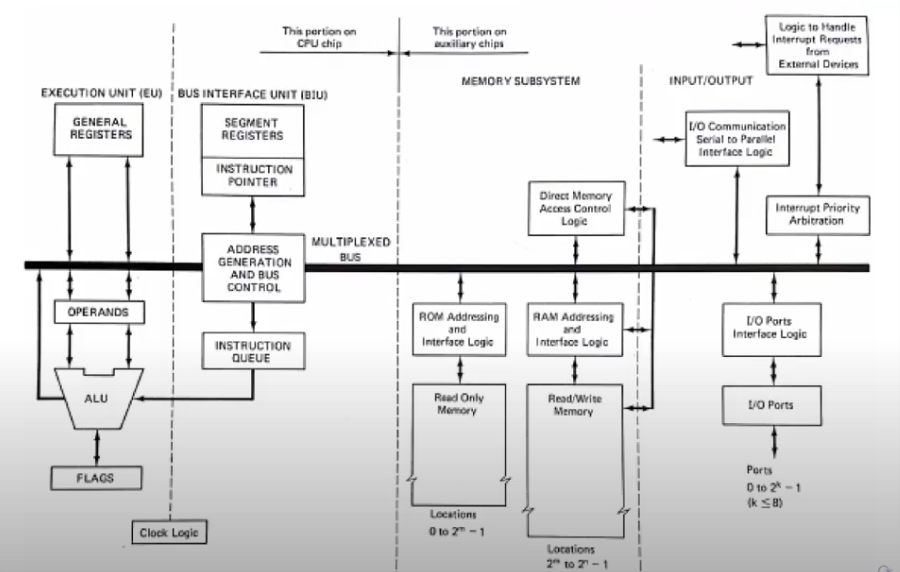
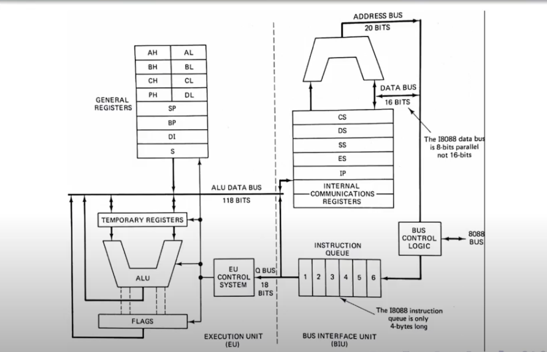
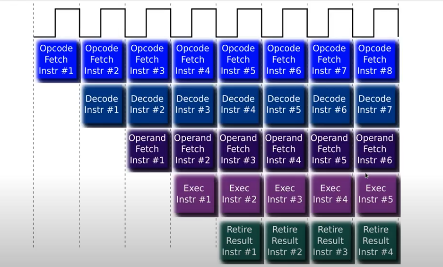
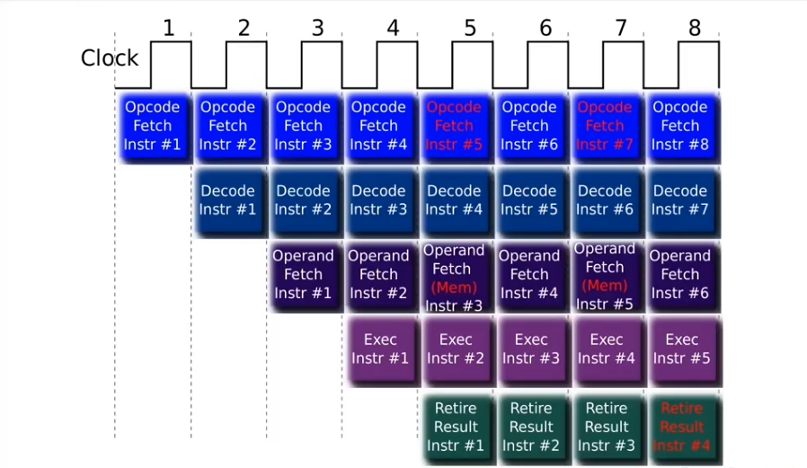
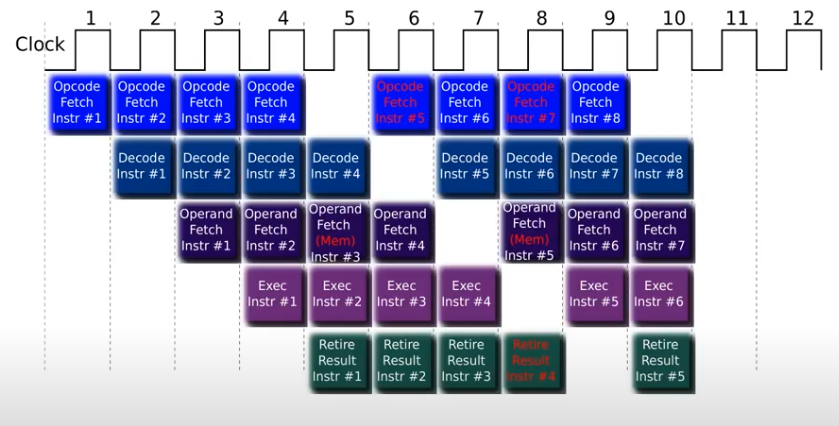
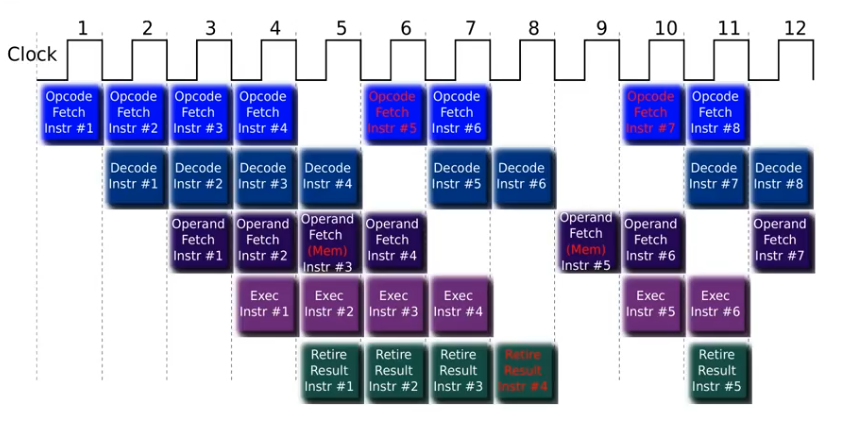
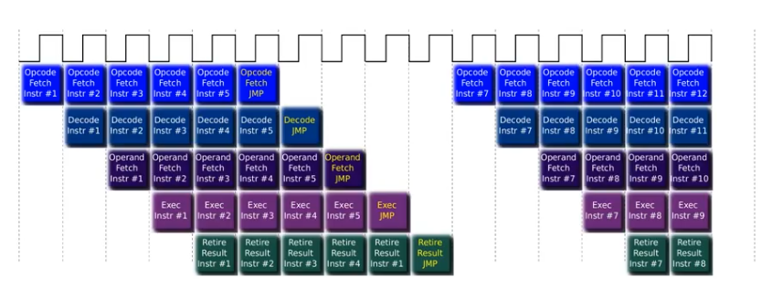

# Intro Arquitectura

No es posible definir la arquitectura de un computador sin manejar de manera solvente varias tecnologías diferentes:

* Diseño lógico.
* Tecnología de encapsulado.
* Funcionamiento y diseño de compiladores y de sistemas operativos.

## Arquitectura vs Microarquitectura

Procesadores con una misma arquitectura, pero con diferente microarquitectura pueden variar drásticamente en cuanto a su performance/costos.

### Arquitectura

Conjunto de recursos accessibles para el programador, que por lo general se mantienen a lo largo de los diferentes modelos de procesadores de esa arquitectura.

* Registros
* ISA
* Estructuras de memoria (descriptores de segmento, de pagina, etc)

Comprende el diseño del set de instrucciones (ISA), el manejo de la memoria y sus modos de direccionamientos, los restantes bloques funcionales que componen al CPU, el diseño lógico, y el proceso de implementación. 

Se trata de definir los aspectos más relevantes en la arquitectura de un computador que maximicen su rendimiento, sin dejar de satisfacer otras limitaciones impuestas por los usuarios, como un costo económico accessible o un consume de energía moderado.

### Microarquitectura

Implementación en el silicio de la arquitectura. Lo que está detrás del set de registros y del modelo de programación. Puede ser muy simple o sumamente robusta y poderosa. Cambia de un modelo a otro dentro de una misma familia.

Determina como se ejecutan las instrucciones, su velocidad, etc.

Microarquitectura es la combinación de Organización + Hardware.

#### Organizacion

Detalles de implementación del ISA:

* Organización e interconexión de memoria.
* Diseño de los bloques de la CPU.
* Diseño de implementación del ISA.
* Implementación del paralelismo a nivel de instrucciones y/o de datos.

Misma ISA puede contar con una organización muy diferente, por ejemplo, los procesadores AMD FX e Intel Core i7 tienen la misma ISA, sin embargo organizan su caché y motor de ejecución de maneras diferentes.

#### Hardware

* Se refiere a los detalles de diseño lógico y tecnología de fabricación.

Existirán procesadores con la misma ISA, y misma organización, pero absolutamente distintos a nivel hardware y diseño lógico detallado.

Por ejemplo, el Pentium 4 diseñado para dekstop y el Pentium 4 M. El último tiene una gran cantidad de lógica para control del consumo de energía, siendo su hardware muy diferente del de Pentium 4 desktop.

## ISA

Instruction Set Architecture es el set de instrucciones visibles por el programador, y el límite entre el software y el hardware.

### Clases

* ISA con General Purpose Registers (GPR) vs Registros Dedicados.
* ISA Registro-Memoria vs Load Store.

### Direccionamiento de Memoria

* Alineacion obligatoria de datos vs Administracion de a bytes.
* Word Addressable vs Byte addressable.

### Modos de direccionamiento

Como se especifican los operandos.

### Tipos y tamaño de operandos

* Enteros
* Punto Flotante
* Punto fijo
* Diferentes tamaños y precisiones

### Instrruciones de control de flujo

* Saltos condicionales
* Calls

### Longitud del Codigo

* Instrucciones de tamaño fijo vs variable

## Modelo de Von Neumann 

* Modelo de programa almacenado.
* Datos y programa en el mismo (único) banco de madera.
  * No se puede leer una instrucción y dato a la vez.
* Máquina de estados.
  * Fetch-Decode-Execute cycle.
* Manchester Baby, IBM-SSEC, EDVAC, BINAC fueron de las primeras implementaciones alrededor de 1948.

### Maxima: Memoria Insuficiente

Durante muchas décadas, la memoria fue el recurso más escaso, y en rigor sigue vigente la máxima de Von Neumann: "_La cantidad de memoria siempre será insuficiente_".

En los albores de la industria, la escasez fue dramática por lo que los los diseñadores de la época apuntaban a microprocesadores con instrucciones muy complejas.

Con los bloques de datos no hay mucho que hacer par ahorrar memoria. Pero en el caso del código, si podemos utilizar menos instrucciones para el mismo trabajo, se ahorra memoria. Este paradigma estuvo presente en todos los diseños durante décadas. Intel desarrolló su arquitectura actual con este paradigma y se comprometió a mantener __compatibilidad__.

### Problemas

* Memoria Insuficiente.
* Von Neumann Bottleneck (único banco de memoria y data path).
* Usuarios demandan disminuir el costo de actualización de los equipos.
* Upgrades obligaban a reemplazar no solo el hardware sino sistema operativo y operaciones.
* Dinámica que dificulta a los proveedores establecer un cash flow que permitiese incrementar inversiones.

### Intel da el golpe

En 1978 se presenta la familia iAPx86 de la mano del procesador 8086 de 16 bits. Intel se compromete a mantener compatibilidad ascendente y fue uno de los motivos por los que IBM decidió adoptar esta familia de procesadores como base para su PC.





## Maquina de Estados Elemental

Algunos conceptos del modelo Von Neuman definido en 1940 todavia viven en procesadores modernos. Uno de ellos es la __máquina de ejecución__.

En las primeras generaciones de microprocesadores cada etapa de este ciclo se ejecutaba en un ciclo de clock, y la CPU entera estaba dedicada a esta tarea, resultando que una instrucción insumía varios ciclos de clock.

## Instruction Level Paralelism - Pipeline

La arquitectura permite crear el efecto de superponer en el tiempo, la ejecución de varias instrucciones a la vez.

* Require muy poco o ningún hardware adicional.
* Solo necesita que los bloques del procesador que resuelven la máquina de estados para la ejecución de una instrucción, operen en forma simulatánea/paralela en instrucciones diferentes.

Es algo parecido a la línea de montaje, en donde cada operación se descompone en partes, y se ejecutan en un mismo momento diferentes partes de diferentes operaciones.



### Obstáculos Estructurales: Acceso Concurrente a memoria

* Un procesador que solo tiene una etapa para acceder a memoria y la comparte para acceso a datos e instrucciones.
* Fetchear opcode & operando a memoria. En el caso de que se necesite un operando de memoria, el acceso para traer este operando interferiría con la búsqueda del operando o instrucción más adelante del programa.



Una solución a esto es posponer una operación un ciclo de clock, y todo lo relacionado a la misma. Siempre se trata de favorecer las instrucciones en curso o que primero se invocaron.



Hay que seguir corriendo hasta remover los obstáculos.



### Obstáculos de control: __Branch Penalty__.

Branch es la peor situación en pérdida de performance.

* Discontinuidad en el flujo de ejecución.
* Pipeline busca instrucciones en secuencia
* El branch hace que todo lo que estaba pre procesado deba descartarse. Y el pipeline se vacía debiendo transcurrir n-1 ciclos de clock hasta el próximo resultado, siendo _n_ la cantidad de etapas del pipeline. Esto se conoce como __Branch penalty__.



## Origenes de RISC: Reduced Instruction Set Computer

Sobre los 80 aparecen los primeros microprocesadores de 16 bits con ciertas capacidades para hacer frente a una nueva generación de equipos de cómputo.

* Intel evoluciona el 8086/88 al 80286, y ensaya el iAPx432 especialmente diseñado para ejecutar lenguajes de alto nivel como Ada.
* Motorola evoluciona al 68000 (citado como m68k).

Vimos que tienen tods un punto en común: __Set de instrucciones de complejidad creciente__.

Desde los años 60 se incursionarion distintas líneas de investigación tendientes a implementar procesadores con pocas instrucciones simples.

En los años '80, David Patterson y John Hennesy publicaron los primeros trabajos con resultados concretos, que presentaban una arquitectura contrapuesta con la de los Computadores que dominaban la industria en ese momento. La denominarion __RISC__, y motivó que a los procesadores diseñados hasta entonces se los etiquete como __CISC__ (Complex Instruction Set Computer).

### Relación con el Pipeline

Analizaron obstáculos en el pipeline, en particular los obstáculos que involucran accesos a memoria para buscar operandos.

Si se evita que los operandos se accedan en memoria, por ejemplo cargarlos previamente en un registro, el pipeline podría mejorarse.

### Mandamientos RISC

* Numerosos registros de propósito general.
* Instrucciones se ejecutan en un solo ciclo de clock.
* Instrucciones derivan en opcodes de igual formato y tamaño.
* Instrucciones sencillas de decodificar, números de registros deben tener la misma ubicación en los códigos de instrucción y deben requerir la misma cantidad de bits para su decodificación.
* No se utiliza microcódigo para decodificar instrucciones.
* Datos de memoria se acceden mediante instrucciones siples de transferencia, como `LOAD` y `STORE`.

### Corolario

La validación de una máquina RISC es mucho más simple de realizar, y también es menor la probabilidad de liberar al mercado un procesador con defectos de lógica.

Es esperable que el tamaño de los programas sea mayor, debido a que lo que los procesadores CISC resuelven con microcódigo, los RISC lo resuelven en el software.

Por ejemplo, una multiplicación se resuelve siempre por acumulación de sumas, el microcódigo se implementa con la instrucción `MUL`, mientras que por software se implementa con una subrutina:

```
sumar:
  sub R2, R2, 1
  add R1, R1, R1
  sub R2, R2, 1
  blez R2, sumar
```