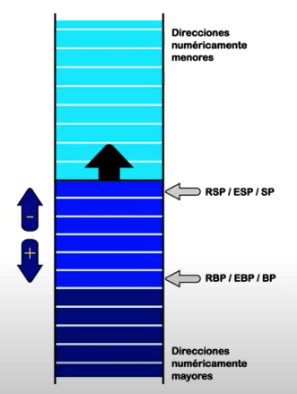

# Pila de Procesadores IA-32 e Intel 64

* Funcionamiento Basico
* Ejemplos, Near, far e Interrupciones
* Convencion de llamadas C
* Interaccion C-ASM

## Funcionamiento Basico

La pila (stack) es un área de memoria contigua, referenciada por un segmento cuyo selector está siempre en el registro SS del procesador.

El tamaño de este segmento en el modo IA-32, puede llegar hasta 4Gbytes de memoria, en especial cuando el sistema operativo utiliza el modelo de segmentación Flat.

El stack es un segmento __Expand Down__, ya que a medida que utilizamos PUSH, su registro de desplazamiento se decrementa apuntado a direcciones mas bajas de memoria, es decir a aquellas numericamente menores.

### Stack Pointer

El segmento se recorre mediante un registro de proósito general, denominado habitualmente en forma genérica _Stack Pointer_, y que en estos procesadores según el modo de trabajo es el registro SP, ESP, o RSP (16, 32 o 64 bits respectivamente).

### Operaciones

Para guardar un dato en el stack, el procesador tiene la instrucción PUSH, y para retirarlo, POP.

Cada vez que ejecuta PUSH, el procesador decrementa el Stack Pointer y luego escribe el dato en el stack, en la direccion apuntada por el registro de segmento SS, y el stack poitner correspondiente al modo de trabajo.

Cada vez que se ejecuta un POP, el procesador lee el item apuntado por el par SS:stack pointer y luego incrementa este ultimo registro.

### Utilizando el stack

Las operaciones de pila se pueden realizar en cualquier momento, se usa cuando:

* Invocamos subrutina desde un programa en Assembler, mediante instruccion CALL.

* Hardware mediante interfaz adecuada envia una Interrupcion al Procesador.

* Desde una aplicación, ejecutamos una Interrupción de Software mediante instrucción INT type.

* Cuando desde un lenguaje como el C se invoca una función cualquiera.

* Instruccion RET de retorno, que consiste en recuperar de la pila la dirección de retorno para cargarla en EIP.

#### Ejemplos

* Near (acceder mismo segmento): Pila guarda EIP.
* Far (acceder otro segmento): Pila guarda CS (Code Segment) y EIP.
* Interrupcion (acceder otro segmento y restaurar flags): Pila guarda CS, EIP y Flags.

#### Interrupciones

En el caso de interrupciones, además de guardar la dirección de retorno como al invocar subrutinas, es necesario guardar el estado del procesador.

De otro modo, si al final de la interrupción alguna instrucción modifica un flag, el estado de la máquina se altera y vuelve al programa modificado.

Por este motivo necesitamos otra instrucción particular de retorno, IRET, que además de la dirección de retorno, recupere los flags.

### Alineación del Stack

* El Stack Pointer debe apuntar a direcciones de memoria alineadas de acuerdo con su ancho de bits.
  * Por ejemplo el ESP (32 bits) debe estar alineado a double words.

* El tamaño de cada elemento de la pila se corresponde con el atributo de tamaño del segmento, es decir, con el modo de trabajo en el que está el procesador, no con el del operando en sí.
  * Ej, PUSH AL, consume 16, 32 o 64 bits dependiendo del tamaño del segmento, nunca consume 8 bits.

* El valor que se decrementa en el Stack Pointer, corresponde con el tamaño del segmento (2, 4 u 8 bytes).

#### Ejemplos

Modo - Alineacion:

* 32 bits - 4 bytes (ABI32)
* 64 bits - 8 bytes (ABI64)
* 64 bits - 16 bytes (libc)
