# Arquitectura x86, Procesadores IA-32

* Historia
* Modos de Operacion
* Modelo del Programador de Aplicaciones
* Tipos de Datos Fundamentales
* Modos de Direccionamiento

## Historia

* En 1984 Intel lanza el primer procesador de 32 bits, el 80386 con su arquitectura IA-32. Aparecen fabricantes que producirán procesadores IA'32 bajo licencia de Intel, entre ellos se destaca AMD.

* A finales de los '90, Intel y Hewlett Packard desarrollan una arquitectura de 64 bits y lanzan sin éxito los procesadores Itanium e Itanium2, principalmente por no tener compatibilidad con la arquitectura anterior.

* AMD extiende los procesadores IA-32 a 64 bits, llamando la nueva arquitectura x86-64 o AMD64 y siendo un gran éxito.

* Intel debió adoptar la arquitectura de AMD64 para IA-32 y la llamó Intel 64.

### Conclusiones

* La __Compatibilidad__ fue clave del éxito de la arquitectura IA-32 pero también ha condicionado su evolución.
* El compromise de compatibilidad adoptado en 1978 significa que las decisiones de fondo adoptadas inicialmente en el diseño de la arquitectura, inevitablemente condicionarán lo que puede o no hacerse a futuro. La administración de memoria por segmentación es un clarísimo ejemplo.

## Modos de Operación

Procesadores IA-31 tienen tres modos de operación, de los cuales surgen sus capacidades e instrucciones disponibles, y un modo especial para tareas específicas del sistema:

* Modo Real
* Modo Protegido
* Modo Mantenimiento del Sistema
* Modo extendido a 64 bits (IA-32e)
  * Submodo Compatibilidad
  * Submodo 64 bits

### Modo Real

* El procesador implementa el entorno de operación del 8086, con algunas extensiones:
  * Puede utilizar registros de 32 bits.
  * Puede reconfigurar la ubicación del vector de interrupciones (IDTR).
* Desde este modo se puede pasar por software al Modo Protegido o al Modo Mantenimiento del Sistema.
* Modo de arranque de cualquier procesador IA-32 e Intel 64 actual y futuro debido a la compatibilidad, aunque nadie trabaja en este modo.

### Modo Protegido

* Se implementa __multitasking__.
* Modo por excelencia de los procesadores de esta familia.
* Se introduce un sub-modo al que puede ponerse a una determinada tarea, denominado Virtual-8086 que permite a un programa diseñado para ejecutarse en un procesador 8086, poder ejecutarse como una tarea en Modo Protegido. Actualmente ya no es utilizado.

### Modo Mantenimiento del Sistema

* El procesador ingresa a este modo por dos caminos:
  * Activación de la señal de interrupción #SMM.
  * Mediante un mensaje SMI desde su APIC local (Interrupciones y SMP).
* Este modo fue introducido para realizar funciones específicas para la plataforma de hardware en la cual se desempaña el procesador, como lo son ahorro de energía y seguridad.
* Al ingresar a este modo, el procesador resguarda en forma automática el contexto completo de la tarea o programa interrumpido, y pasa a ejecutar en un espacio seaprado. Una vez efectuadas las operaciones necesarias y cuando debe salir de este modo, el procesador reasume la tarea o programa interrumpida en el modo de operación en el que se encontraba.

### Modo extendido a 64bits (IA-32e)

* Los procesadores Intel 64 además de los modos de trabajo de IA-32, incluyen un modo IA-32e en el que se active la arquitectura de 64 bits.
* Para pasar a este modo, el procesador debe:
  * Estar trabajando en Modo Protegido
  * Tener Paginación Habilitada
  * PAE (Page Address Extention) activo
* IA-32e a su vez cuanta con dos sub-modos.
  * Submodo Compatibilidad
  * Submodo 64 bits

#### Submodo Comptabilidad

* Pensado para garantizar la transición de 32 a 64 bits, permitiendo aplicaciones de 16 y 32 bits legacy ejecutarse sin recompilación bajo un sistema operativo de 64 bits.
  * Entorno de ejecución de la tarea de 32 bits es la de la arquitectura IA-32.
  * Kernel no soporta el manejo de tareas del modo IA-32.
  * Sub-modo Virtual 8086 desaparece.
  * Incluye mecanismos de protección del modo 64 bits.
* Sistema Operativo de 64 bits puede ejecutar tareas de 16 y 32 bits junto con otras de 64 bits, sobre la base de diferentes segmentos de código. La tarea de 32 bits accede a una arquitectura IA-32 pura, utilizando direcciones de 16 y 32 bits, con 4Gbytes de espacio de direccionamiento y con la posibilidad de acceder por encima de ese límite habilitando PAE.

#### Submodo 64 bits

* Este modo habilita un Sistema Operativo de 64 bits a ejecutar tareas escritas utilizado direcciones lineales de 64 bits.
* Se extienden de 8 a 16 los Registros de propósito general, cuyo ancho de palabra ahora es de 64 bits, agregándose los registros R8 a R15.
* Se introduce el prefijo `REX` para las instrucciones que deseen acceder a las versiones de estos registros de 64 bits.
* Los registros SIMD también se extienden a 16 manteniendo su ancho de 18 bits, XMM0 a XMM15.

## Modelo del Programador de Aplicaciones

### Arquitectura de 16 bits básica

#### Registros y Espacio de Direccionamiento

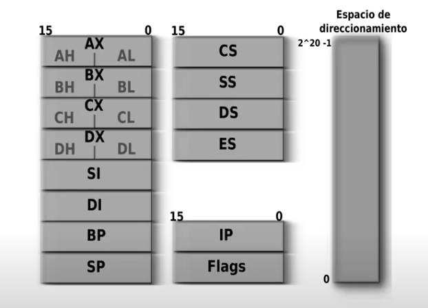

* AX: Acumulador
* BX: Base
* CX: Contador
* DX: Data
* SourceIndex y DestinationIndex: Enteros, generalmente utilizados como punteros a memoria.
* BasePointer y StackPointer: Punteros de pila.
* CodeSegment, StackS, DataS, ExtraS: Registros de segmentos.

#### Floating Point Unit

FPU es una unidad donde podemos desarrollar aritmética más avanzada, con números reales en notación científica.

Tiene 8 registros R0-R7 de 80 bits de ancho y registros de control.

Como no entraba en el 8086, se entregaba en conjunto con un chip separado. Más adelante, con el 486 de 32 bits, la tecnología avanzó como para que los microprocesadores integren su propia FPU.

Utilizan como datos el standard [IEEE 754](https://en.wikipedia.org/wiki/IEEE_754) de Extended Double, Double Precision & Single Precision.

### Arquitectura 32 bits básica

#### Registros y Espacio de Direccionamiento

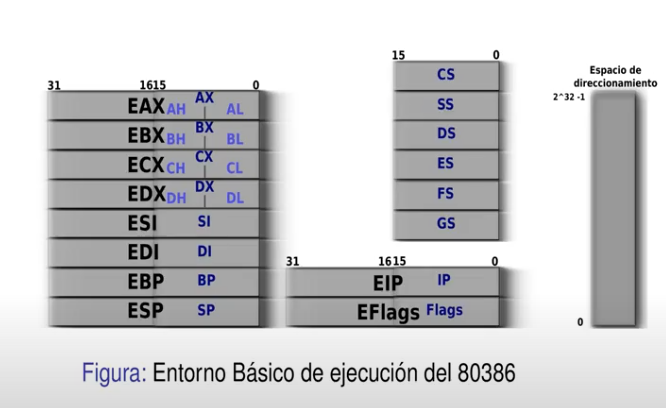

Convierte los registros a contener palabras de 32 bits, pero mantiene compatibilidad siendo que los 16 bits menos significativos de los registros, siguen pudiendo ser referenciados por segmentos de 8 bits (AX, BX, CX, DX).

#### Extensiones MMX (Multimedia Extensions)

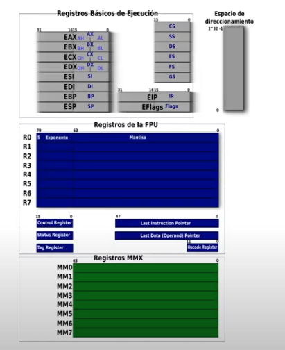

Con el tiempo, se comenzó a integrar, a la arquitectura y organización, recursos para procesar algoritmos de video y audio (Digital Signal Processing).

Desde el punto de vista de la arquitectura, se agregarion los registros MMX (Multimedia Extensions) de 64 bits cada uno, MM0-MM7 que permiten __data level parallelism__. Esto "empaquetar" words de distinto tamaño y procesarlas como una simple instrucción, por ejemplo, procesando en vez de un número de 64 bits, 8 números de 8 bits en una misma instrucción.

Estos registros funcionan como ALIAS de los 64 bits menos significativos de los 8 registros de la FPU. Entonces la limitación, es que __no se pueden mezclar instrucciones de la FPU con MMX__, porque cada vez que quieras pasar de MMX a FPU, hay que correr una instrucción que restaure los registros.

#### Extensiones XMM

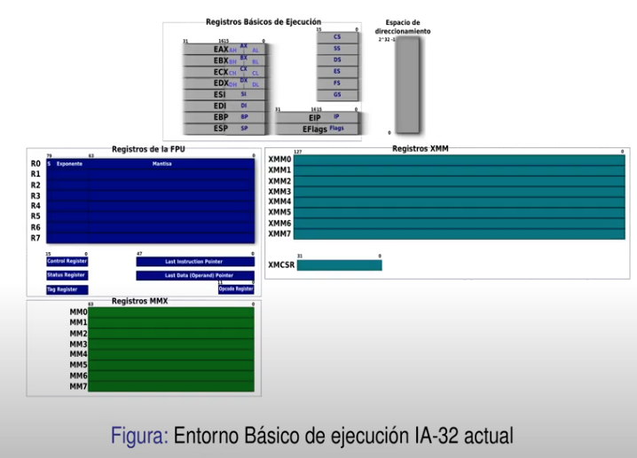

Registros __independientes__ de 128 bits para procesamiento vectorial (__Data Level Parallelism__)

Se introdujeron con la llegada del __Pentium III__.

### Arquitectura Intel 64 bts

#### Extensiones de 64 bits

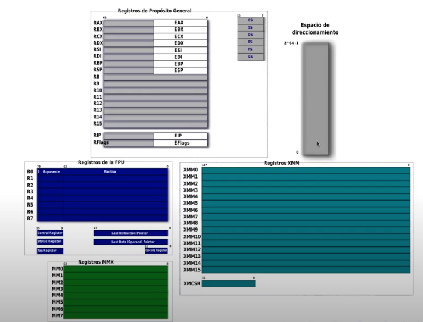

* 16 registros de proposito general de 64 bits, donde se extienden los 8 ya existentes registros cuya parte baja sigue funcionando como registros de 32 bits, y se agregan otros 8 registros (R8 a R15) de 64, que tambien pueden ser accesibles como registros de 16 y 8 bits.

* El procesador, a pesar de estar en modo 64 bits, puede acceder a diferentes tamaños de operador utilizando el prefijo REX.

* Espacio de direccionamiento de 0 a 2^64-1 (64 bytes).

* La parte de la FPU, y MMX no cambia.

* Se elevan los Registros XMM a 16 registros.

#### Flags

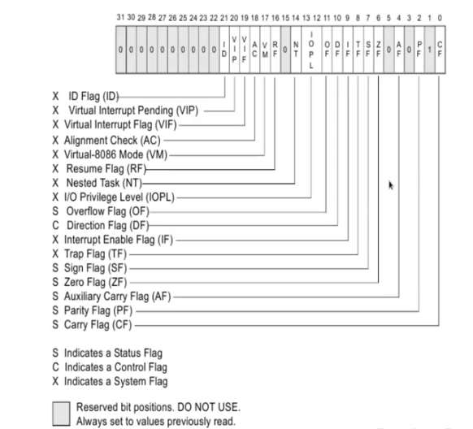

#### Como obtener operandos

* Instruccion en si misma (operando implícito)
* Registro
* Posicion de memoria
* Port de E/S

## Tipos de Datos Fundamentales

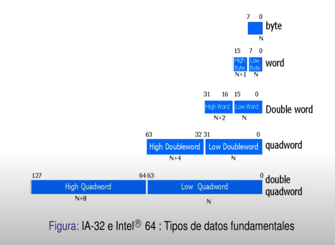

### Almacenamiento en Memoria

#### Little Endian

Una variable de varios bytes de tamaño, almacena su byte menos significativo en la dirección con la que referencia la variable, y a partir de allí coloca el resto de los bytes en órden ascendente de significancia, terminando con el almacenamiento del byte más significativo en la dirección de memoria más alta.

A simple vista, pareciera que están almacenados "al revés", ya que si lo miramos en la memoria, está de atrás hacia adelante.

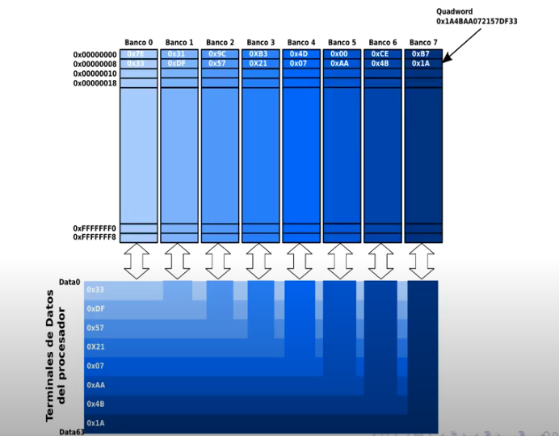

### Alineación de Memoria

* Procesadores IA-32 e Intel 64 no ponen restricciones respecto de la alineación en memoria para diferentes variables de los programas, dando gran flexibilidad.
* Si una variable queda repartida en dos filas diferentes, se requerirán dos ciclos de lectura para accederla, teniendo una pérdida de __performance__.
* Esto puede evitarse usando directivas de alineación que todos los lenguajes poseen.

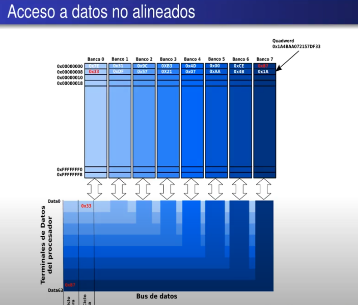

## Modos de Direccionamiento

* Implicito
* Inmediato
* A Registro
* A Memoria
* Base Directo
* Base + Desplazamiento

### Implicito

Instruciones en las cuales el code op es suficiente como para establecer que operación realizar y cual es el operando (tambien aquellas que no requieren operandos).

Ejemplos de este Modo, las instrucciones que operan sobre los flags:

* CLC (Clear Carry), STC (Set Carry) y CMC (Complement Carry), donde el operando Flag CF esta implicito.

* CLD (Clear Direction Flag) y STD (Set Direction Flag).

* CLI y STI 

### Inmediato

Operando viene dentro del codigo de la instruccion.

Un ejemplo es la suma.

### A Registro

Todos los operandos involucrados son Registros del procesador.

### A memoria

#### Espacio Fisico

Los procesadores IA-32 organizan la memoria como una secuencia de bytes, direccionables a traves de su Bus de Address.

La memoria conectada a este bus se denomina __memoria fisicia__.

El espacio de direcciones que pueden volcarse sobre este bus se denomina __direcciones fisicas__.

#### Segmentacion vs Paginacion

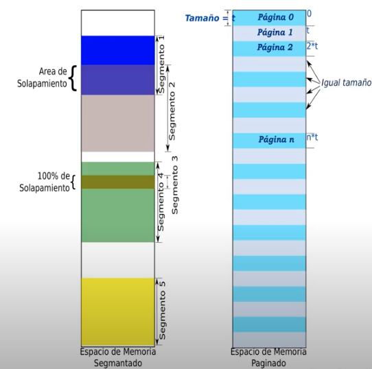

Los segmentos se diferencian en:

* Segmentos de tamaño variable.
* Mucho mas flexible para definir segmentos proporcionales al tamaño de datos a guardar.
* Solapamiento.
* Discontinuidad.
* Require mas control y complejidad.

Por diversos motivos que en su momento tuvieron sentido, Intel definió organizar el espacio de direccinoamiento de la Familia iAPx86 en segmetos. El compromiso de compatibilidad ató a los siguientes procesadores a mantener este esquema.

#### Espacio Lógico

Condiciones iniciales de segmentación:

* 4 registros de segmento para almacenar hasta 4 selectores de segment.
* Registros de 16 bits, los segmentos tienen a lo sumo 64K de tamaño.
* __Dirección lógica__: Expresión de las direcciones en el modelo de programación mediante dos valores, que se traduce a una dirección física (__Dirección Efectiva__):
  * Identificador de segmento en el que se encuentra la variable o instrucción que se desea direccionar.
  * Desplazamiento, offset, o __dirección efectiva__ a partir del inicio de ese segmento. Este offset se incluye en la instrucción como un valor en forma explícita.

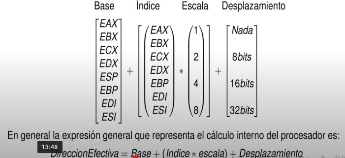

### Base Directo

En este modo el offset está contenido directamente en un registro Base. El procesador simplemente toma el offset desde el registro sin otro calculo.

### Base + Desplazamiento

Combina el valor contenido en un registro que apunta a la base de un bloque de datos con un valor explícito puesto en la instrucción (desplazamiento), que permite calcular la dirección efectiva.

Tambien resulta útil para acceder a una estructura más compleja de datos, apuntando a la base de la estructura con un registro y utilizando el Desplazamiento para acceder al campo deseado de la estructura.

#### Utilidad

* Este modo es especial para acceder a matrices bidimensionales.
* Un ejemplo obligado es el buffer de video.